# Sala Company — Start Page

**Live: [go.sala.company](https://go.sala.company)**

The start page for all of Sala Company's browser projects: live world news, market heatmaps, games and AI tools. Everything is free and runs in the browser, with no sign-up and no install. Almost all of it was vibe coded from the start: built by describing it to an AI and refining it together, rather than written line by line.

[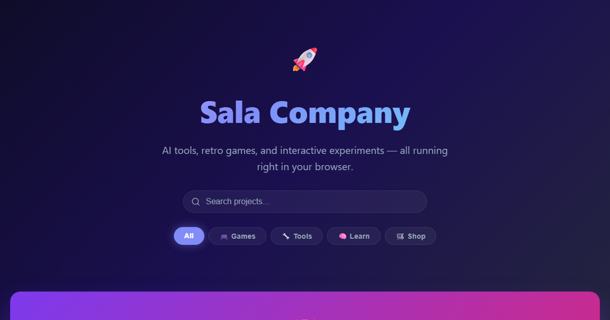](https://go.sala.company)

## What's new — October 2026

The page has a matching **What's new** strip under the search bar. Update both together, and keep it to the last month or so.

- **Sala News** is out of beta: a new look, about 95 live sources, breaking-news alerts and videos from 29 news channels.
- **Heat Rates:** official government bond yield curves for 14 markets, with real yields and ten years of history.
- **Rizq:** traders and banking, a pickup truck home for your herd, smarter animals and a daily run.
- **New start page design:** projects grouped by what they are, a screenshot on every card, light and dark themes, and the most active projects first.

## Projects

In the order the page shows them, most active first.

### 🔴 Live data

| | Project | What it is | Code |
|---|---|---|---|
| 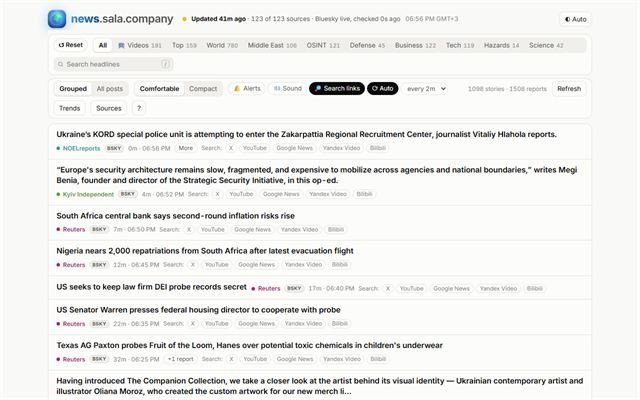 | **[Sala News — The World Now](https://news.sala.company)** | Live world headlines from about 95 news, OSINT and disaster sources, refreshed every few minutes, with breaking-news alerts, videos from 29 news channels and search links under every headline. | [the-world-now](https://github.com/jamalxcode/the-world-now) |
| 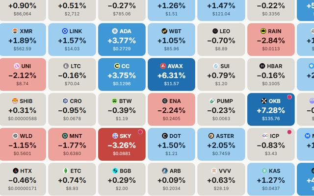 | **[Heat — Market Heatmaps](https://heat.sala.company)** <br>[Forex](https://heat.sala.company/forex/) · [Metals](https://heat.sala.company/metals/) · [Energy](https://heat.sala.company/energy/) · [Rates](https://heat.sala.company/rates/) | The top 100 coins with RSI, trend, point & figure, momentum and suggested stop-losses on every tile, and a daily scorecard that checks the signals against what happened next. Also 48 currencies (ECB rates), precious metals, oil and gas, and official bond yield curves for 14 markets. Refreshes every 10 minutes. *Beta, not financial advice.* | [heat](https://github.com/jamalxcode/heat) |

### 🟠 Games

| | Project | What it is | Code |
|---|---|---|---|
| 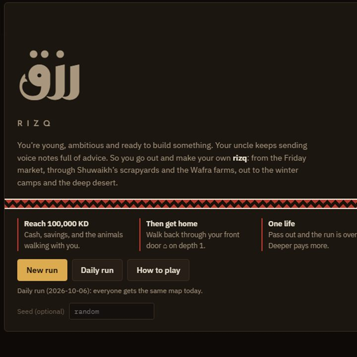 | **[Rizq — A Kuwaiti Roguelike](https://rizq.sala.company)** | A Brogue-inspired roguelike set in modern Kuwait. Build a camel herd with dates, trade and bank at diwaniyas, survive the deep desert, reach 100,000 KD and make it home. One life, plus a daily run on the same map for everyone. The featured card. | [rizq](https://github.com/jamalxcode/rizq) |
| 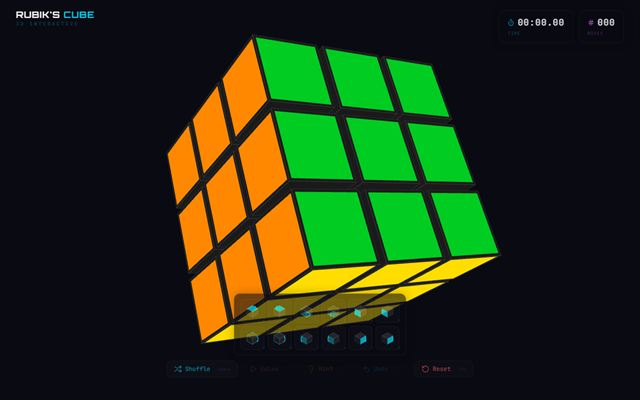 | **[3D Rubik's Cube](https://cube.sala.company)** | Scramble, turn and solve a 3D cube, with hints. React and Three.js. | [cube](https://github.com/jamalxcode/cube) |
| 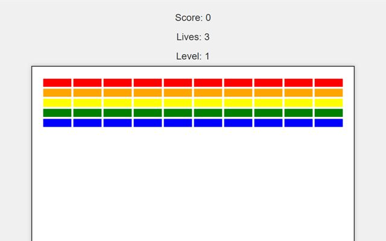 | **[Vibe Coded Breakout](https://breakout.sala.company)** | The arcade classic, vibe coded from the start. | [breakout-game-html](https://github.com/jamalxcode/breakout-game-html) |
| 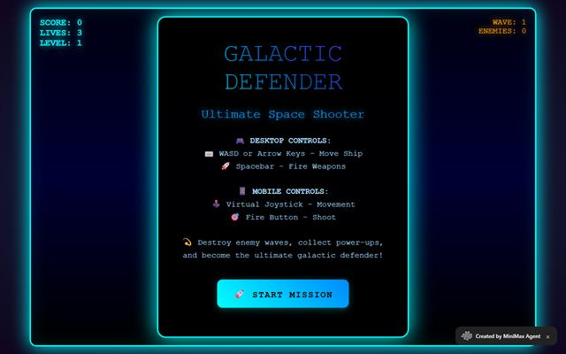 | **[Galactic Defender](https://galacticdefender.sala.company)** | A Galaga-inspired space shooter with keyboard and touch controls. | [galactic_defender](https://github.com/jamalxcode/galactic_defender) |
| 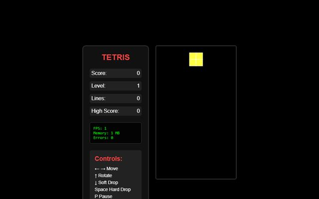 | **[Vibe Coded Tetris](https://tetris.sala.company)** | The classic puzzle game, vibe coded from the start. | [tetris3](https://github.com/jamalxcode/tetris3) |

### 🟣 AI

| | Project | What it is | Code |
|---|---|---|---|
| 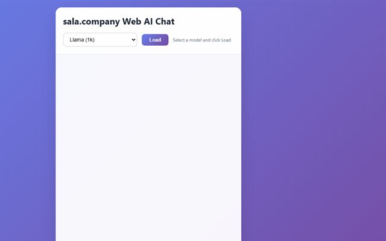 | **[WebAI — Private Browser AI Chat](https://webai.sala.company)** | Chat with open models (Llama, Phi, Mistral, Qwen, Gemma, TinyLlama) running on your own device through WebGPU. Nothing leaves the browser. Needs a WebGPU browser such as recent Chrome or Edge. | [webllm-onefile](https://github.com/jamalxcode/webllm-onefile) |
| 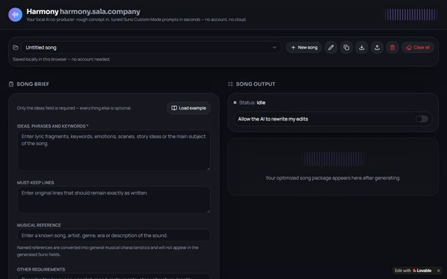 | **[Harmony](https://harmony.sala.company)** | A local AI co-producer for Suno: turns a rough song idea into titles, genre tags, lyric skeletons and exclude lists for Custom Mode. | — |
|  | **[How AI Works](https://understand.sala.company)** | Plain-language explanations of AI, from rule-based systems to neural networks and large language models. Made in [Gamma](https://gamma.app/). | — |
| 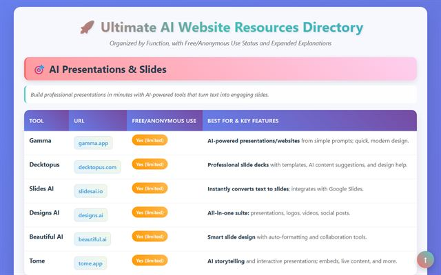 | **[AI Tools Collection](https://ai.sala.company)** | A curated directory of AI websites and tools, grouped by what they do and whether they're free. | [ai-sala-company](https://github.com/jamalxcode/ai-sala-company) |

### 🟢 More

| | Project | What it is | Code |
|---|---|---|---|
| 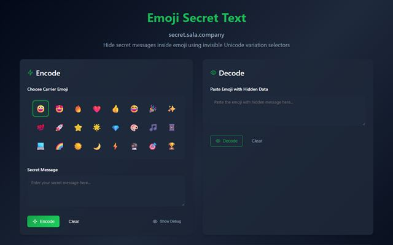 | **[Secret Emoji Messenger](https://secret.sala.company)** | Hide a secret message inside an emoji with invisible Unicode characters. | [hidetext](https://github.com/jamalxcode/hidetext) |
| 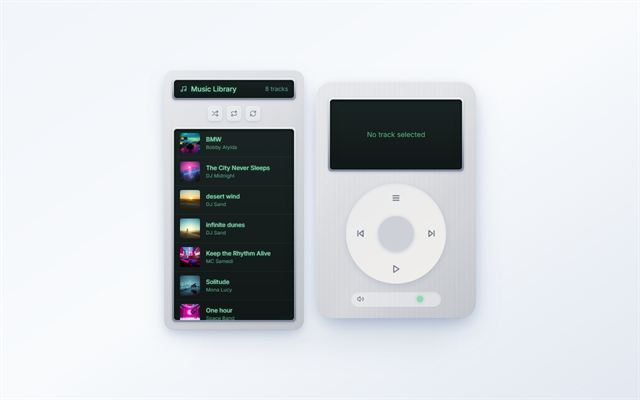 | **[iPod Classic Player](https://music.sala.company)** | A faithful iPod Classic in the browser for your own MP3s. | [retro-tunes-player](https://github.com/jamalxcode/retro-tunes-player) |
| 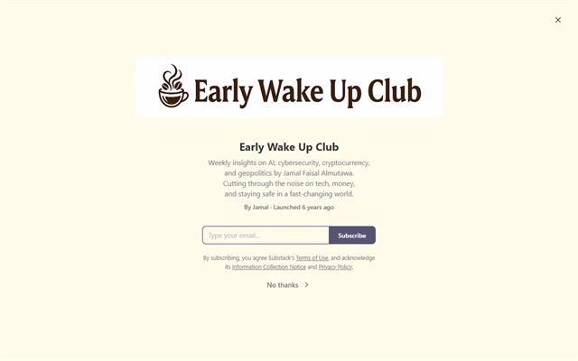 | **[Early Wake Up Club](https://mutawa.substack.com)** | A newsletter on technology, business and AI. Recent: [The Trillion Dollar Club](https://mutawa.substack.com/p/the-trillion-dollar-club) (Jan 2026), [From Mining Bitcoin to Powering ChatGPT](https://mutawa.substack.com/p/from-mining-bitcoin-to-powering-chatgpt) (Dec 2025), [The Great AI Chip War](https://mutawa.substack.com/p/the-great-ai-chip-war-how-china-and) (Nov 2025). | — |
| 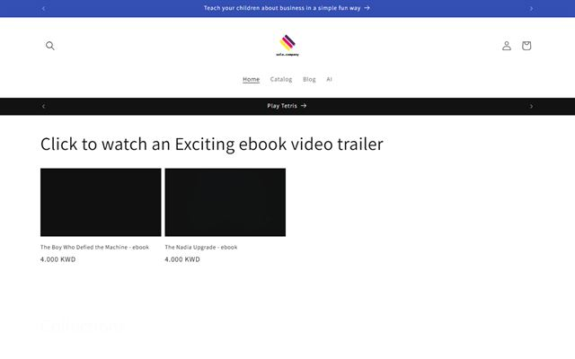 | **[Sala Company Store](https://www.sala.company)** | Ebooks: sci-fi thrillers such as *The Boy Who Defied the Machine*, AI guides, business and children's books. | — |

## How the page works

- **One file, no build step.** Everything is in `index.html`: plain HTML, CSS and JavaScript with no dependencies. GitHub Pages serves it at `go.sala.company` (see `CNAME`), and every push to `main` goes live in about a minute.
- **Sections:** Live data, Games, AI and More, each an `<h2>`; every card title is an `<h3>`.
- **Search and filters:** the search box matches card titles, text and each item's `data-tags`. The filter buttons (`aria-pressed`) show one section. Empty sections hide, and the What's new strip hides while searching or filtering. A link like [`go.sala.company/?q=heat`](https://go.sala.company/?q=heat) opens with that search applied.
- **Cards:** the title link covers the whole card, so a click anywhere opens the project. Extra links (Heat's markets, the newsletter articles) sit above it and stay clickable.
- **Badges:** **New** for about 30 days after a launch, **Updated** for a big recent change, **Beta** while a project is a work in progress. Remove them when they go stale.
- **Featured card:** adding `feature` to an item's class gives it a 2×2 block on wider screens (Rizq today).
- **Theme:** light and dark follow the system. The ◐ button cycles Auto → Light → Dark and remembers the choice in that browser.
- **Font:** Inter (`fonts/inter-latin.woff2`), hosted here so the page makes no calls to Google, as on heat and news.

## Adding or changing a project

1. **Card:** copy an `<li class="item">` in the right section of `index.html` and change the link, title, text, `data-tags`, screenshot and button label (`Play … →` for games, `Open … →` for everything else).
2. **Screenshot:** save a 640×400 JPEG as `img/<project>.jpg`. The current ones were taken with headless Edge at 1280×800, then cropped and scaled:
   ```
   msedge --headless=new --hide-scrollbars --window-size=1280,800 --virtual-time-budget=10000 --screenshot=shot.png https://example.sala.company
   ```
3. **Structured data:** add the project to the `ItemList` in the JSON-LD at the top of `index.html`, in page order, and update `numberOfItems`.
4. **What's new:** add a line to the strip on the page and to this README.
5. **Dates:** set `dateModified` in the JSON-LD and `lastmod` in `sitemap.xml` to today.
6. **Link preview (optional):** if the top of the page changed, retake `og-image.png` at 1200×630.

## Search engines and link previews

- **Title and description** written for search results, within Google's display limits.
- **Canonical URL** `https://go.sala.company/`, plus Google and Bing site-verification tags.
- **Link previews** (Open Graph and X): `og-image.png`, a 1200×630 screenshot of the page.
- **Icons:** the "S" mark in `favicon.svg`, with `favicon-48.png` and `favicon.ico` for browsers and search results, and `apple-touch-icon.png` (180×180, square; phones round the corners) for home screens.
- **Structured data** (JSON-LD): the `WebSite` with its search (`?q=`, which really works), the `WebPage` (with `dateModified`), the `Organization`, and an `ItemList` of every project in page order, each a free `WebApplication`, `VideoGame` or `WebSite` with its own description and screenshot.
- **Crawlable text:** the What's new strip and an About / FAQ section give search engines plain text about each project. The cards are visible without JavaScript.
- **`robots.txt`** and **`sitemap.xml`**.

## Files

| File | What it is |
|---|---|
| `index.html` | The whole page: markup, styles, script and structured data |
| `img/` | One screenshot per project (and `rates.jpg`, used only in the structured data) |
| `fonts/inter-latin.woff2` | The Inter typeface |
| `favicon.svg`, `favicon-48.png`, `favicon.ico`, `apple-touch-icon.png` | Icons |
| `og-image.png` | The link-preview image |
| `robots.txt`, `sitemap.xml` | For search engines |
| `CNAME` | The custom domain, `go.sala.company` |
